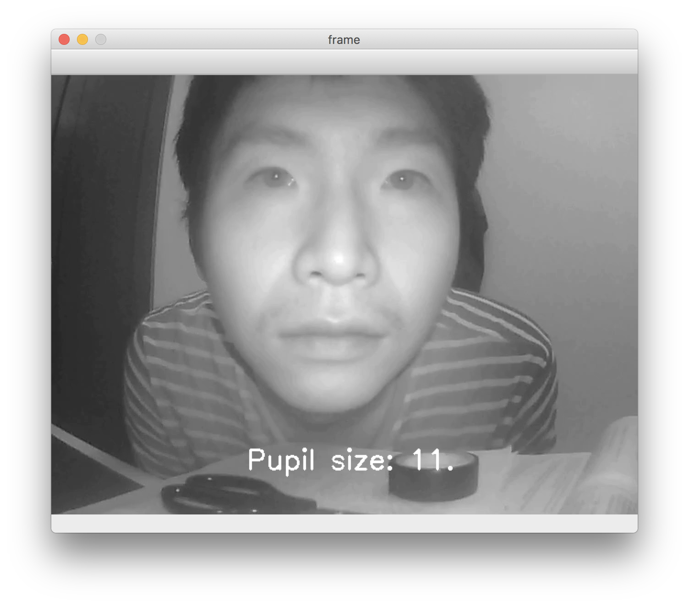
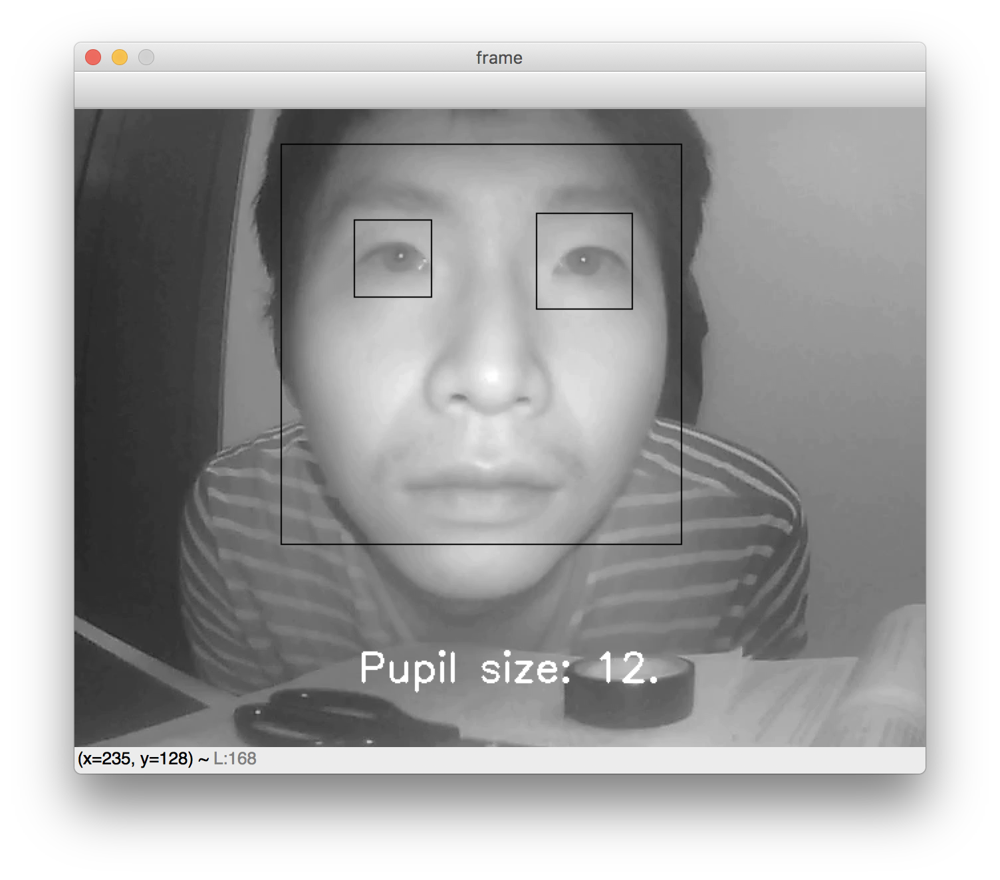

# Pupil Dilation Measurement
> This project is built as part of an assessment from Reality Detector.

![Build Status][travis-image]

## Overview
This program aims to measure pupil dilation from a videostream and output the result on-screen.

## Dependencies
```
- Python >= 3.7
- OpenCV >= 4.1.0
```

## Usage example

pupil_measurement.py contains the main program. Please also download the test video and place both in the same directory.

The directory structure should look like:
```
dir
│───pupil_measurement.py
└───test_vid.mov
```

To run the program, navigate to dir, and run the following in bash:

```sh
python3 pupil_measurement.py
```
Press q any time to quit.

The pupil dilation measurement is shown on the screen.

There are a few flags for the user to toggle with.

### Flags - wait_key

```sh
python3 pupil_measurement.py -wait_key 200
```
This slows down the playing speed to 200ms/frame.

### Flags - show_boxes
```sh
python3 pupil_measurement.py -show_boxes
```
Another option allows bounding boxes for face and eyes to be displayed.



## Contributing

1. Fork it (<https://github.com/yourname/yourproject/fork>)
2. Create your feature branch (`git checkout -b feature/fooBar`)
3. Commit your changes (`git commit -am 'Add some fooBar'`)
4. Push to the branch (`git push origin feature/fooBar`)
5. Create a new Pull Request

<!-- Markdown link & img dfn's -->
[npm-image]: https://img.shields.io/npm/v/datadog-metrics.svg?style=flat-square
[npm-url]: https://npmjs.org/package/datadog-metrics
[npm-downloads]: https://img.shields.io/npm/dm/datadog-metrics.svg?style=flat-square
[travis-image]: https://img.shields.io/travis/dbader/node-datadog-metrics/master.svg?style=flat-square
[travis-url]: https://travis-ci.org/dbader/node-datadog-metrics
[wiki]: https://github.com/yourname/yourproject/wiki
